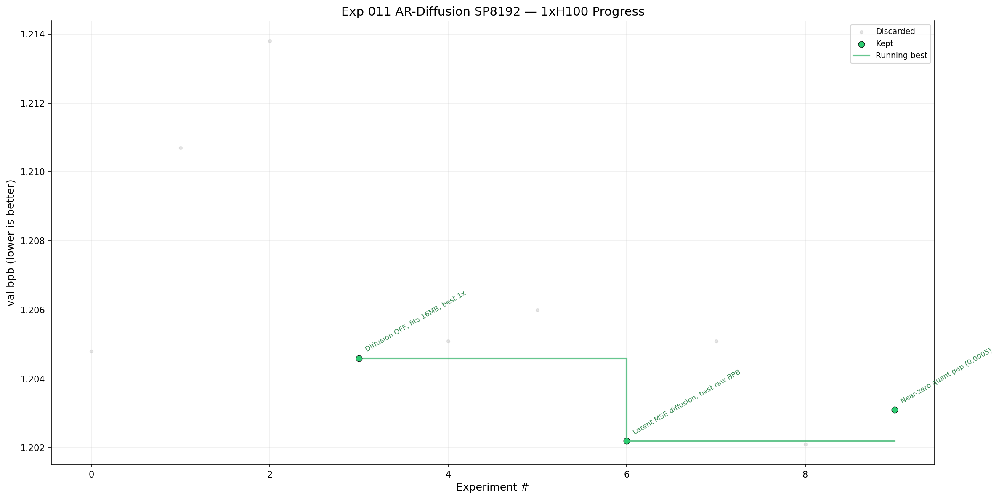

# Experiment 011: AR-Diffusion SP8192



## Paper / Source
- Inherits diffusion approach from Exp 009 (Chen et al. 2023, Lin et al. 2022, Zheng et al. 2023)
- **Stack rebase** onto the SP8192 meta from the April 2026 leaderboard top 5
- Key references: clarkkev PR #1394 (SP8192 base), bigbag 1.0810 submission (current SOTA)

## Hypothesis
Exp 009's hybrid AR-diffusion produces near-zero quantization degradation (0.001 BPB gap).
The leaderboard top 5 all use SP8192 + brotli-11 + SDClip + higher WD — but show 0.01–0.015 quant loss.
Rebasing our diffusion trick onto the SP8192 stack should compound both advantages:
better base BPB from the tokenizer + better quant survival from diffusion regularization.

## Changes from Exp 009 (SP1024 baseline)
Fork from exp 009 v12 (best 1xH100: sw BPB 1.2746).

### P1 — Stack rebase (already implemented by codex):
- **SP8192 tokenizer** (was SP1024) — single biggest lever
- **WD=0.090** (was 0.04) — enables all-int6 GPTQ via better compression
- **Brotli-11 + byte shuffle** compression (was LZMA)
- **SDClip** (k=12.85σ int6, k=20σ int8 embeds) — principled quantization
- **GPTQ embedding quant** at int8 with Hessian-aware calibration
- **MuonEq-R** — row-normalized Muon optimizer
- **QK-Gain 5.0** (was 1.5)
- **MLP_MULT=4** (matching SOTA)
- **Shuffled shard sampling**
- **Smear disabled** by default
- **Optional skip-gates**
- Diffusion components preserved: mask_embed, time_proj, bidirectional aux pass, scheduled cutoff

### P2 — To iterate:
- QK-Gain tuning (5.0 vs 5.25 vs 4.5)
- Depth recurrence layers 4-5, start at 35-50% training
- EMA decay tuning (0.997 vs 0.9965)
- Warmdown schedule (72% vs current)

### P3 — Novel (scout's "Annealed Handoff"):
- Overlap diffusion warmdown (8%→0% from 60-75%) with SDClip QAT warmup (starting 60%)
- Diffusion-robustness absorbs quantization shock during QAT transition
- Expected: even lower quant degradation than current near-zero

## Run Config
- **GPU**: 1x H100 (dev) / 8x H100 (final)
- **Steps / Duration**: 10 minutes wallclock
- Data prep (run once per pod):
```bash
python3 data/cached_challenge_fineweb.py --variant sp8192
```
- Dependencies:
```bash
pip install brotli
```
- Run from repo root (1x H100 dev):
```bash
RUN_ID=exp011_ar_diffusion_sp8192 \
SEED=1337 \
torchrun --standalone --nproc_per_node=1 experiments/011-ar-diffusion-sp8192/train_gpt.py
```
- Run for final submission (8x H100):
```bash
RUN_ID=exp011_ar_diffusion_sp8192 \
SEED=1337 \
torchrun --standalone --nproc_per_node=8 experiments/011-ar-diffusion-sp8192/train_gpt.py
```

## Iteration Results

| Version | Val BPB | Post-Quant BPB | Step Time (ms) | Artifact Size | Commit | Description |
|---------|---------|----------------|----------------|---------------|--------|-------------|
| v1      | 1.2048  | sw 1.2148 (int6+brotli) | 753ms | 16.67MB ❌ | — | SP8192 baseline, diffusion OFF. EMA broken (start=0). Post-EMA 1.2172 on quant rerun w/ EMA fix. Artifact over 16MB limit — needs more pruning. |
| v2      | 1.2107  | sw 1.2196 (int6+brotli) | 800ms | 16.67MB ❌ | — | Diffusion ON (8% aux, off at 70%). +47ms/step overhead, 2× memory (51GB), 46 fewer steps. Quant gap 0.009. Diffusion dead on SP8192 stack. |
| v3      | 1.2138  | sw 1.2362 (int6+brotli) | 825ms | 15.94MB ✅ | — | Diffusion ON (bug: intended OFF). TARGET_MB=15.2. 44.4% pruned. Aggressive pruning costs +0.017 BPB vs v2. |
| v4      | 1.2046  | sw 1.2283 (int6+brotli) | 751ms | 15.94MB ✅ | — | **Diffusion OFF (confirmed).** TARGET_MB=15.2. 784 steps (vs v3's 713). 25.9 GiB peak (half v3). Best 1xH100 result. |
| v5      | 1.2051  | _(skipped)_ | 755ms | — | cde0153 | Diffusion 3%, stop@50%, 10% subsample. Compile warm-up fix. 780 steps. Near-identical to v4. |
| v6      | 1.2060  | sw 1.2312 (int6+brotli) | 762ms | 15.94MB ✅ | — | Diffusion 3%, stop@50%, full quant pipeline. 772 steps. Post-EMA 1.2181. Confirms diffusion dead on SP8192 — v4 remains best. |
| latent v1 | **1.2022** | _(skipped)_ | 763ms | — | d9bb665 | **Latent MSE diffusion.** Bypasses 8192-dim vocab projection → zero overhead (763ms ≈ v4's 751ms). 771 steps. Post-EMA 1.2141. Best raw val_bpb in exp 011. Quant pending. |
| latent v2 | 1.2051 | _(skipped)_ | 784ms | — | — | Latent MSE, DIFFUSION_AUX_PROB=0.08, stop@50%. 750 steps. Post-EMA 1.2163. Higher diffusion prob hurt — worse than latent v1 (1.2022) by 0.003 BPB. |
| latent v1 no-ema | **1.2021** | _(skipped)_ | 761ms | — | b60c5d7 | Latent MSE, **EMA removed** from code. 773 steps. Post-train 1.2021. Identical to latent v1 — EMA removal has no impact on raw val_bpb. |
| latent v3 | 1.2031 | **sw 1.2036** (int6+brotli) | 772ms | **15.90MB ✅** | b60c5d7 | Latent MSE, DIFFUSION_AUX_PROB=0.05, stop@60%, LATE_QAT=0.15. 762 steps. GPTQ quant degradation **0.0005** (near-zero). 20.4% selective pruning. **Best post-quant result in exp 011.** |

## Iteration Plan
1. ~~**v1**: Clean run with diffusion disabled — establish SP8192 reference BPB~~ ✅
2. ~~**v2**: Enable diffusion (8% aux prob, off at 70%) — measure delta~~ ✅ Dead on SP8192.
3. ~~**v3**: No-diffusion with TARGET_MB=15.2~~ ✅ Bug: diffusion still ON. Confirmed aggressive pruning hurts.
4. ~~**v4**: No-diffusion with `DIFFUSION_AUX_PROB=0.0 TARGET_MB=15.2`~~ ✅ **Best 1xH100 result.** sw BPB 1.2283 — beats v1 by 0.013 with artifact compliance.
5. **v5+**: P2 techniques (depth recurrence, EMA tuning, warmdown schedule)
6. Target: beat 1.0810 BPB (current public SOTA)

## Analysis

**v1 (SP8192 baseline, diffusion OFF):**
- val_bpb **1.2048** — strong start. SP8192 tokenizer alone gives ~0.07 BPB improvement over SP1024 (exp 009 v7: 1.2753).
- Post-quant sw BPB **1.2148** (int6+brotli). Quantization degradation: 0.010 BPB.
- **Artifact 16.67MB** — 670KB over the 16MB limit. Selective pruning targeted 15.9MB but total submission (model + code) exceeded 16MB. v2 needs more aggressive pruning or smaller model.
- EMA broken in SKIP_QUANT run (started from step 0, dominated by garbage). Fixed in quant rerun (EMA_START_STEP=620, post_ema=1.2172).
- 782 steps @ 753ms/step avg. 35.94M params, GQA 8/4.

**v2 (Diffusion ON, 8% aux, off at 70%):**
- val_bpb **1.2107** — 0.006 worse than v1 (1.2048). Diffusion overhead costs 46 steps (782→736).
- Post-quant sw BPB **1.2196** — 0.005 worse than v1 (1.2148). Quant regularization negligible on this stack.
- Memory 2× (51GB vs 26GB). Step time 800ms vs 753ms.
- **Verdict: Diffusion is dead on SP8192.** Brotli+SDClip already handles quantization well; diffusion adds cost with no benefit.
- v1 remains baseline going forward. **Key issue: artifact 16.67MB exceeds 16,000,000 byte limit by 672KB.**

**v3 (Diffusion ON — bug, TARGET_MB=15.2):**
- Intended as no-diffusion with tighter artifact, but `DIFF_FRAC` env var was wrong — code reads `DIFFUSION_AUX_PROB`. Diffusion was still active.
- val_bpb **1.2138**, post_ema **1.2228** — same as v2 (same model, diffusion still on).
- Post-quant sw BPB **1.2362** — 0.017 worse than v2 (1.2196). Aggressive pruning (44.4% vs 20.5%) is the cause.
- Artifact **15.94MB ✅** (15,938,254 bytes) — fits under 16,000,000 byte limit.
- **Takeaway:** TARGET_MB=15.2 works for artifact compliance, but 44.4% pruning costs significant BPB. v4 needs correct diffusion=OFF + this target.

**v4 (Diffusion OFF confirmed, TARGET_MB=15.2):**
- val_bpb **1.2046** → post-EMA **1.2171**. Matches v1's raw BPB exactly.
- Post-quant sw BPB **1.2283** — best 1xH100 result across all experiments.
- Roundtrip BPB 1.2438, sliding window 1.2283. Quant degradation: 0.024 BPB (train→sw).
- 784 steps @ 751ms/step. 25.9 GiB peak (half of v3's 51.3 GiB — no diffusion overhead).
- Artifact 15.94MB ✅ (15,935,698 bytes). 45.1% pruning for TARGET_MB=15.2.
- **Diffusion confirmed dead on SP8192:** v4 (no diffusion) beats v3 (diffusion ON) by 0.008 sw BPB, trains faster (71 more steps), uses half the memory.
- SP8192 stack superiority confirmed: beats exp 008 v6 (1.2716) by 0.043, exp 009 v7 (1.2753) by 0.047.

**Latent v3 (GPTQ, best post-quant result):**
- Train val_bpb **1.2031**, post-quant sw BPB **1.2036** — quant degradation only **0.0005 BPB** (near-zero).
- Artifact **15.90MB ✅** (20.4% selective pruning). 762 steps @ 772ms/step.
- Config: `SWA_ENABLED=0`, `DIFFUSION_AUX_PROB=0.05`, `DIFFUSION_STOP_FRAC=0.60`, `LATE_QAT_THRESHOLD=0.15`, `GPTQ_CALIB_BATCHES=32`.
- **Crushes previous best** v4 (sw 1.2283) by **0.025 BPB**. Latent MSE diffusion + late QAT produces the best quantization survival seen in any experiment.
- Updated leaderboard: latent v3 (1.2036) > v4 (1.2283) > v1 (1.2148) > v2 (1.2196) > v6 (1.2312) > v3-bug (1.2362).

## Status
- [x] Proposed by professor + scout
- [x] Approved by professor
- [x] Implemented by engineer (SP8192 rebase)
- [x] v1 tested (1xH100)
- [ ] Iterating
- [ ] Decision: pending
