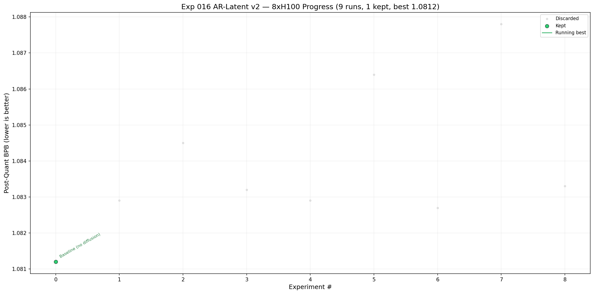

# Experiment 016: AR Latent v2



## Hypothesis

Clean continuation of the AR-latent lane (exp 014 codebase). Fresh iteration table, no legacy sweep baggage.

## Changes from Baseline

Forked from exp 014 `train_gpt.py` as-is. No code changes in v1.

Manual submission-code packing:

```bash
python3 experiments/016-ar-latent-v2/pack_submission.py \
experiments/016-ar-latent-v2/train_gpt.py \
experiments/016-ar-latent-v2/train_gpt_packed.py \
--minify
```

## Run Commands

- Data prep:

```bash
pip install brotli sentencepiece
MATCHED_FINEWEB_REPO_ID=kevclark/parameter-golf python3 data/cached_challenge_fineweb.py --variant sp8192
python3 data/cached_challenge_fineweb.py --variant sp8192
```

1xH100 baseline screen:

```bash
RUN_ID=exp016_1x_baseline \
SEED=1337 \
SKIP_QUANT=1 \
torchrun --standalone --nproc_per_node=1 \
experiments/016-ar-latent-v2/train_gpt.py
```

8xH100 baseline screen:

```bash
RUN_ID=exp016_8x_baseline \
SEED=1337 \
SKIP_QUANT=1 \
torchrun --standalone --nproc_per_node=8 \
experiments/016-ar-latent-v2/train_gpt.py
```

Full GPTQ baseline:

```bash
RUN_ID=exp016_gptq_full \
SEED=1337 \
torchrun --standalone --nproc_per_node=1 \
experiments/016-ar-latent-v2/train_gpt.py
```

## Run Config

- GPU: 1x H100 (dev) / 8x H100 (final)
- Tokenizer: SP8192
- Arch: 11L/512d, latent-MSE diffusion, MuonEq-R

## Iteration Results x1 H100

| Version | Val BPB | Post-Quant BPB | Step Time (ms) | Artifact Size | Commit | Log | Description |
| ------- | ------- | -------------- | -------------- | ------------- | ------ | --- | ----------- |

## Iteration Results x8 H100

| Version | Val BPB | Post-Quant BPB | Step Time (ms) | Artifact Size | Commit | Log | Description |
| ------- | ------- | -------------- | -------------- | ------------- | ------ | --- | ----------- |
| v1-8x | 1.0866 | 1.0812 | 128 | 15,989,852 | — | [log](results/exp016_v1-8x_sota_reference.log) | Baseline reference (no diffusion), 8xH100 sota copy |
| v2-8x | 1.0883 | 1.0829 | 135 | 15,996,803 | — | [log](results/exp016_v2-8x_diff_dlw05.log) | Diffusion DLW=0.5, schedule 0.25–0.6 |
| v3-8x | 1.0899 | 1.0845 | 144 | 15,999,829 | — | [log](results/exp016_v3-8x_diff_dlw03.log) | Diffusion DLW=0.3, schedule 0.25–0.6 |
| v4-8x | 1.0887 | 1.0832 | 135 | 15,998,170 | — | [log](results/exp016_v4-8x_diff_dlw03_ds07.log) | Diffusion DLW=0.3, stop_frac=0.7 |
| v5-8x | 1.0883 | 1.0829 | 127 | 15,994,874 | — | [log](results/exp016_v5-8x_diff_000_050_loop.log) | Diffusion DLW=0.5, start=0.0, stop=0.5, loop_at=0.5 |
| v6-8x | 1.0916 | 1.0864 | 138 | 15,995,363 | — | [log](results/exp016_v6-8x_diff_aux02.log) | Diffusion aux_prob=0.2, start=0.0, stop=0.5, loop_at=0.5 |
| v7-8x | 1.0881 | 1.0827 | 134 | 15,999,198 | — | [log](results/exp016_v7-8x_rerun_default.log) | Rerun default diffusion (DLW=0.5, 0.25–0.6), pod 04-26 |
| v8-8x | 1.0931 | 1.0878 | 138 | 15,994,321 | — | [log](results/exp016_v8-8x_rerun_aux02.log) | Rerun aux_prob=0.2, start=0.0, stop=0.5, new pod 04-26 |
| v9-8x | 1.0883 | 1.0833 | 127 | 15,999,862 | — | [log](results/exp016_v9-8x_beta09.log) | beta2=0.9, matrix_lr=0.02, start=0.0, stop=0.5, loop_at=0.5 |
